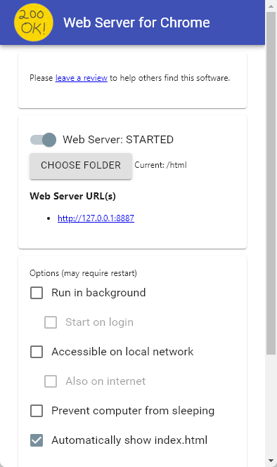
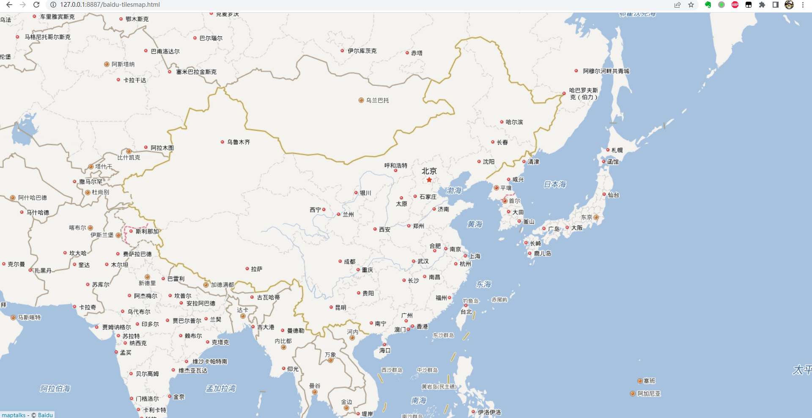
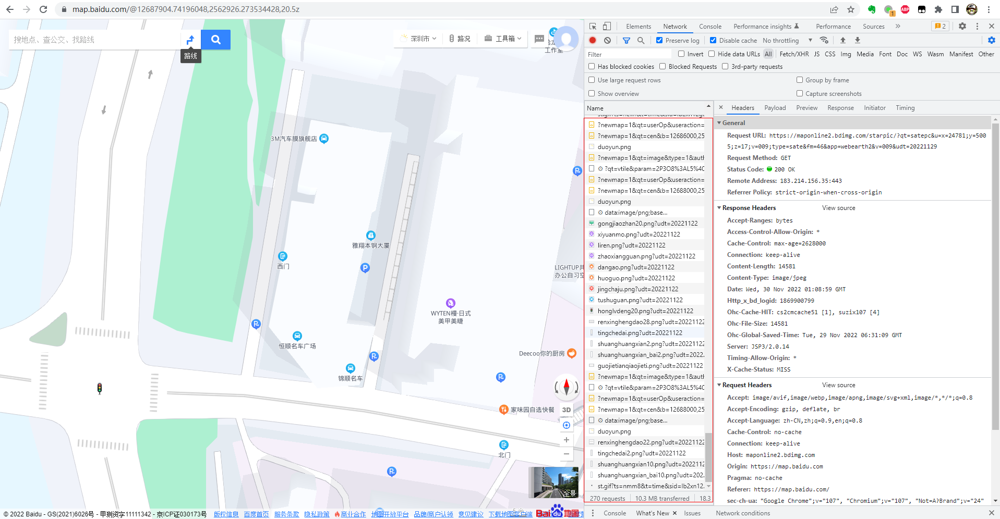
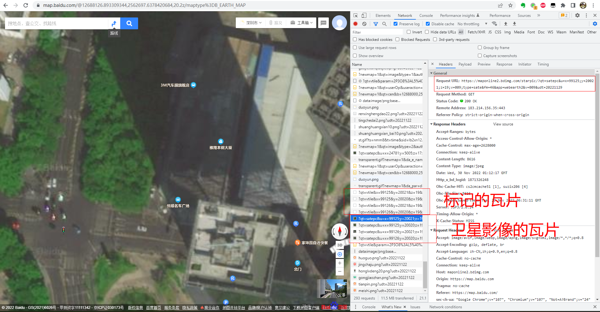
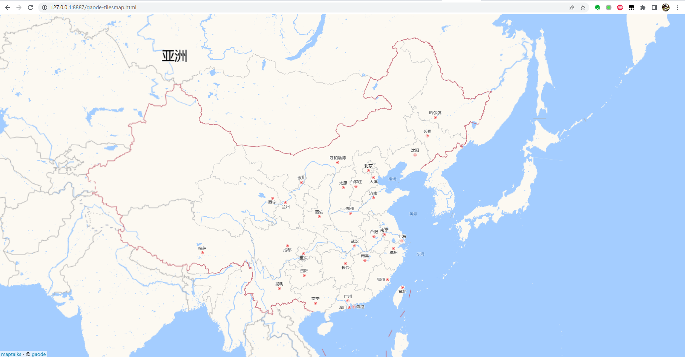
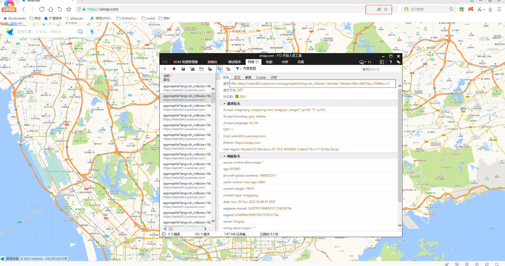
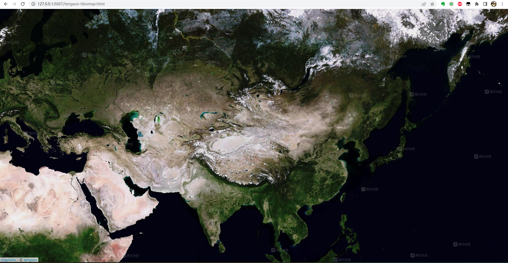
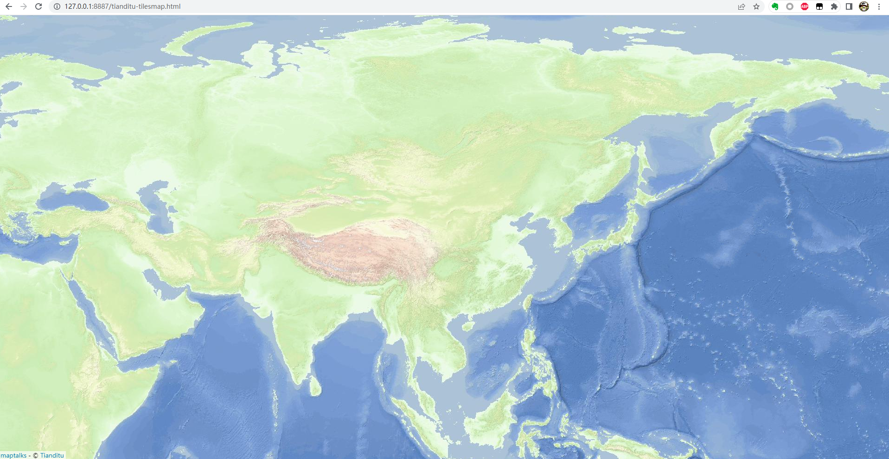
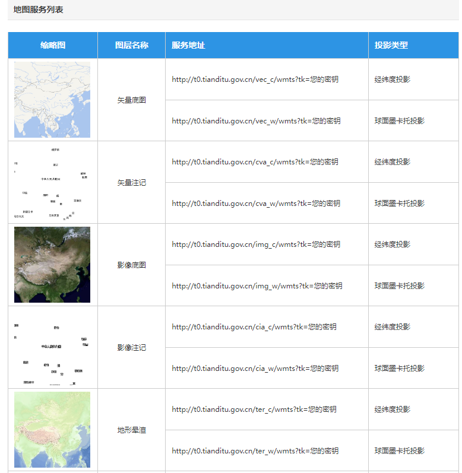
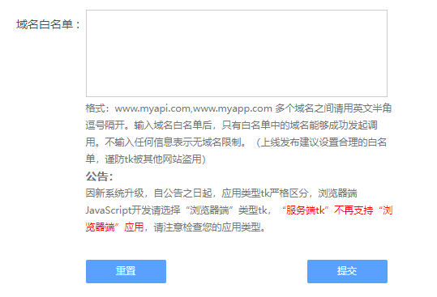

# 加载瓦片地图

## 开发环境准备

### 代码编辑

随意，选择一款自己喜欢的文本编辑器，vscode、notpad++

### 运行环境

准备一个web服务器，如nginx；如果嫌麻烦，推荐使用Chrome浏览器插件：`Web Server for Chrome`




## 加载百度地图

### 示例代码

百度地图做了特殊的处理，需要配置地图投影。

```html
<!DOCTYPE html>
<html>
  <meta charset="UTF-8">
  <meta name="viewport" content="width=device-width, initial-scale=1">
  <title>瓦片图层与地理投影 - 百度投影底图</title>
  <style type="text/css">
    html,body{margin:0px;height:100%;width:100%}
    .container{width:100%;height:100%}
  </style>
  <link rel="stylesheet" href="https://unpkg.com/maptalks/dist/maptalks.css">
  <script type="text/javascript" src="https://unpkg.com/maptalks/dist/maptalks.min.js"></script>
  <body>
    <div id="map" class="container"></div>

    <script>
      var map = new maptalks.Map('map', {
        center: [105.08052356963802, 36.04231948670001],
        zoom: 5,
        minZoom:1,
        maxZoom:19,
        spatialReference:{
          projection : 'baidu'
        },
        baseLayer: new maptalks.TileLayer('base', {
          'urlTemplate' : 'https://maponline{s}.bdimg.com/tile/?qt=tile&x={x}&y={y}&z={z}&udt=20221125',
          'subdomains':[0, 1, 2, 3],
          'attribution' :  '&copy; <a target="_blank" href="http://map.baidu.com">Baidu</a>'
        })
      });

    </script>
  </body>
</html>

```



### `URLTemplate`说明

#### 获取瓦片的urlTemplate

打开百度地图官网，打开开发者模式，可以看到，最新的百度地图并没有直接暴露瓦片的urlTemplate，如下图


切换到卫星视图，才会看到瓦片的urlTemplate



获取到卫星影像瓦片的url如下：

https://maponline1.bdimg.com/starpic/?qt=satepc&u=x=99125;y=20020;z=19;v=009;type=sate&fm=46&app=webearth2&v=009&udt=20221129

转换为瓦片的urlTemplate如下：

`https://maponline{s}.bdimg.com/starpic/?qt=satepc&u=x={x};y={y};z={z};v=009;type=sate&fm=46&app=webearth2&v=009&udt=20221129`

获取到标注瓦片的url如下：

https://maponline0.bdimg.com/tile/?qt=vtile&x=23&y=5&z=7&styles=sl&showtext=0&v=083&udt=20221129

修改`qt=vtile`参数，转换为瓦片地图`qt=tile`，去除不必要的参数，最终得到瓦片的urlTemplate如下：

`https://maponline{s}.bdimg.com/tile/?qt=tile&x={x}&y={y}&z={z}&udt=20221125`

最好得到百度地图的urlTemplate如下：

- 地图：`https://maponline{s}.bdimg.com/tile/?qt=tile&x={x}&y={y}&z={z}&udt=20221125`
- 卫星：`https://maponline{s}.bdimg.com/starpic/?qt=satepc&u=x={x};y={y};z={z};v=009;type=sate&fm=46&app=webearth2&v=009&udt=20221129`


## 加载高德地图

### 示例代码

```html
<!DOCTYPE html>
<html>
  <meta charset="UTF-8">
  <meta name="viewport" content="width=device-width, initial-scale=1">
  <title>瓦片图层 - 高德</title>
  <style type="text/css">
    html,body{margin:0px;height:100%;width:100%}
    .container{width:100%;height:100%}
  </style>
  <link rel="stylesheet" href="https://unpkg.com/maptalks/dist/maptalks.css">
  <script type="text/javascript" src="https://unpkg.com/maptalks/dist/maptalks.min.js"></script>
  <body>
    <div id="map" class="container"></div>

    <script>
      var map = new maptalks.Map('map', {
        center: [105.08052356963802, 36.04231948670001],
        zoom: 5,
        minZoom:1,
        maxZoom:19,
        baseLayer: new maptalks.TileLayer('base', {
          'urlTemplate' : 'http://webrd0{s}.is.autonavi.com/appmaptile?lang=zh_cn&size=1&scale=1&style=8&x={x}&y={y}&z={z}',
          'subdomains':[1, 2, 3, 4],
          'attribution' :  '&copy; <a target="_blank" href="https://amap.com/">gaode</a>'
        })
      });

    </script>
  </body>
</html>
```


### `URLTemplate`说明

高德地图使用通用的web墨卡托投影，不需要做特殊处理，最终的urlTemplate如下：

- 地图：`https://webrd0{s}.is.autonavi.com/appmaptile?lang=zh_cn&size=1&scale=1&style=8&x={x}&y={y}&z={z}`
- 卫星：`https://wprd0{s}.is.autonavi.com/appmaptile?x={x}&y={y}&z={z}&lang=zh_cn&size=1&scl=1&style=8&ltype=11`

> 高德官网的地图和百度一样，采用了新的渲染方式，隐藏了瓦片的地址，不过可以通过IE等老版本的浏览器，依然可以获取瓦片的地址。



## 加载腾讯地图

### 示例代码

```html
<!DOCTYPE html>
<html>
  <meta charset="UTF-8">
  <meta name="viewport" content="width=device-width, initial-scale=1">
  <title>瓦片图层 - 腾讯</title>
  <style type="text/css">
    html,body{margin:0px;height:100%;width:100%}
    .container{width:100%;height:100%}
  </style>
  <link rel="stylesheet" href="https://unpkg.com/maptalks/dist/maptalks.css">
  <script type="text/javascript" src="https://unpkg.com/maptalks/dist/maptalks.min.js"></script>
  <body>
    <div id="map" class="container"></div>

    <script>
      function urlTemplate(x,y,z) {
        let domain = '';
        const subdomains = [0, 1, 2, 3];
        let s = (x + y) % subdomains.length;
        if (s < 0) {
            s = 0;
        }
        domain = subdomains[s];
        const x_u = x >> 4;
        const y_u = y >> 4;
        return `https://p${domain}.map.gtimg.com/sateTiles/${z}/${x_u}/${y_u}/${x}_${y}.jpg?version=258`
      }
      var map = new maptalks.Map('map', {
        center: [105.08052356963802, 36.04231948670001],
        zoom: 5,
        minZoom:4,
        maxZoom:18,
        baseLayer: new maptalks.TileLayer('base', {
          'tileSystem': [1, 1, -20037508.34, -20037508.34],
          'urlTemplate': urlTemplate,
          //'urlTemplate' : 'https://rt{s}.map.gtimg.com/tile?z={z}&x={x}&y={y}&type=vector&styleid=1&version=1245',
          'subdomains':[0, 1, 2, 3],
          'attribution' :  '&copy; <a target="_blank" href="https://map.qq.com/">tengxun</a>'
        })
      });
    </script>
  </body>
</html>
```



### `urlTemplate`说明

腾讯采用的TMS的坐标系统，需要配置一下`tileSystem`参数。瓦片坐标系统后续做详细介绍，这里不再赘述，参考示例代码。

通过官网获取到的urlTemplate如下：

- 地图：`https://rt{s}.map.gtimg.com/tile?z={z}&x={x}&y={y}&type=vector&styleid=1&version=1245`
- 卫星：`https://p${domain}.map.gtimg.com/sateTiles/${z}/${x_u}/${y_u}/${x}_${y}.jpg?version=258`

其中，卫星影像的瓦片比较特殊，路径中多了两个层级参数，没办法直接使用。查阅maptalks的API文档，发现urlTemplate参数可以是function，即可以自己定义urlTemplate的规则，同时参考maptalks的源码，得到最终的urlTemplate的计算方法，如示例代码所示。

## 加载天地图

天地图的瓦片地图服务有配额限制，实际项目不建议使用。

### 示例代码
<!DOCTYPE html>
<html>
  <meta charset="UTF-8">
  <meta name="viewport" content="width=device-width, initial-scale=1">
  <title>瓦片地图 - 天地图</title>
  <style type="text/css">
    html,body{margin:0px;height:100%;width:100%}
    .container{width:100%;height:100%}
  </style>
  <link rel="stylesheet" href="https://unpkg.com/maptalks/dist/maptalks.css">
  <script type="text/javascript" src="https://unpkg.com/maptalks/dist/maptalks.min.js"></script>
  <body>
    <div id="map" class="container"></div>

    <script>
      var map = new maptalks.Map('map', {
        center: [105.08052356963802, 36.04231948670001],
        zoom: 4,
        minZoom:1,
        maxZoom:18,
        spatialReference:{
          projection:'EPSG:4326'
        },
        baseLayer: new maptalks.TileLayer('base', {
          tileSystem : [1, -1, -180, 90],
          urlTemplate: 'https://t{s}.tianditu.gov.cn/ter_c/wmts?SERVICE=WMTS&REQUEST=GetTile&VERSION=1.0.0&LAYER=ter&STYLE=default&TILEMATRIXSET=c&FORMAT=tiles&TILEMATRIX={z}&TILEROW={y}&TILECOL={x}&tk=e62fd5f781f5d5d55e23baccd7d028d9',
          subdomains:['1', '2', '3', '4', '5'],
          attribution : '&copy; <a target="_blank" href="http://www.tianditu.cn">Tianditu</a>'
        })
      });

    </script>
  </body>
</html>
```




### `URLTemplate`说明

天地图[官网](http://lbs.tianditu.gov.cn/server/MapService.html)有其瓦片地图的详细说明，如下图所示。其中经纬度投影需要配置坐标系统和投影参数，球面墨卡托投影为使用默认参数，无需特殊配置。


> 需要注意的是天地图有tk参数，开发和上线时需要注意官方的说明，如下图所示。
> 


